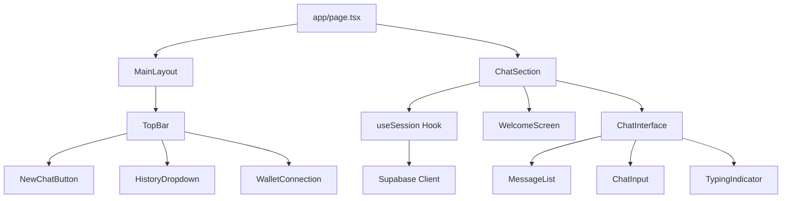
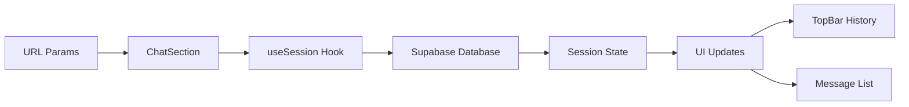
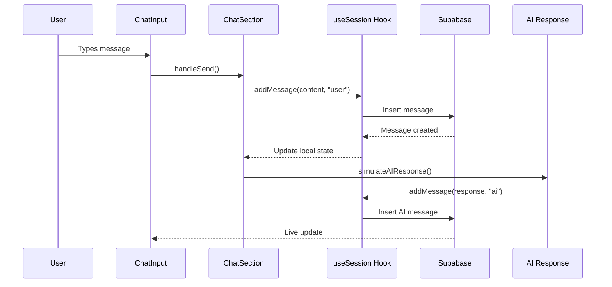
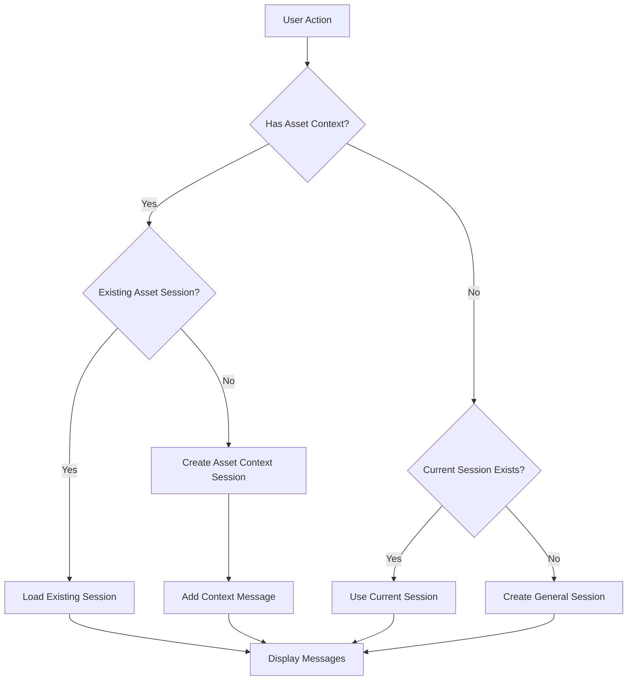

# StratiFi Chat Interface - Code Flow & Component Documentation

## 📋 Table of Contents

1. [Component Hierarchy](#component-hierarchy)
2. [Data Flow Architecture](#data-flow-architecture)
3. [Session Management Logic](#session-management-logic)
4. [Message Flow](#message-flow)
5. [State Management](#state-management)
6. [Event Handling](#event-handling)
7. [Database Interactions](#database-interactions)
8. [Code Examples](#code-examples)

---

## 🏗️ Component Hierarchy

```
App Root
├── MainLayout
│   ├── TopBar
│   │   ├── NewChatButton
│   │   ├── HistoryDropdown
│   │   └── WalletConnection
│   └── ChatSection
│       ├── WelcomeScreen
│       ├── ChatInterface
│       │   ├── MessageList
│       │   ├── TypingIndicator
│       │   └── ChatInput
│       └── useSession Hook
```

### Component Relationships



---

## 🔄 Data Flow Architecture

### 1. URL Parameter Flow

```typescript
// app/page.tsx - URL Parameter Extraction
const searchParams = useSearchParams();
const token = searchParams.get("token"); // "eth"
const poolId = searchParams.get("pool"); // "aave-eth"
const action = searchParams.get("action"); // "lend"

// Pass to ChatSection
<ChatSection token={token} poolId={poolId} action={action} />;
```

### 2. Session State Flow



### 3. Message Flow



---

## 🎛️ Session Management Logic

### Session Creation Decision Tree



### Asset Context Session Logic

```typescript
// components/sections/chat-section.tsx
useEffect(() => {
  if (user && token && poolId && action) {
    // Create unique key for this asset context
    const contextKey = `${token}-${poolId}-${action}`;

    // Prevent duplicate handling
    if (assetContextHandled.current === contextKey) {
      console.log("Asset context already handled:", contextKey);
      return;
    }

    // Check for existing session with same context
    const existingSession = sessions.find((session: any) => {
      const context = session.metadata?.initialContext;
      return (
        context?.token === token &&
        context?.poolId === poolId &&
        context?.action === action
      );
    });

    if (existingSession) {
      // Load existing session
      console.log("Found existing session:", existingSession.id);
      setCurrentSession(existingSession);
      loadMessages(existingSession.id);
      assetContextHandled.current = contextKey;
    } else {
      // Create new asset context session
      console.log("Creating new session for asset context");
      createSession(user.id, { token, poolId, action }).then((newSession) => {
        if (newSession) {
          // Add initial context message
          const contextMessage = generateAssetDetailsMessage(
            token,
            poolId,
            action
          );
          addMessage(contextMessage, "ai", newSession);
          assetContextHandled.current = contextKey;
        }
      });
    }
    setShowWelcome(false);
  }
}, [user, token, poolId, action]);
```

### General Session Creation

```typescript
// On user interaction without asset context
const handleSend = async () => {
  if (!input.trim() || !user) return;

  const userMessage = input.trim();
  setInput("");
  setShowWelcome(false);

  // Create session if none exists
  let sessionToUse = currentSession;
  if (!sessionToUse) {
    console.log("Creating new session for message:", userMessage);
    sessionToUse = await createSession(user.id);
    if (!sessionToUse) {
      console.error("Failed to create session");
      return;
    }
  }

  // Add user message and generate AI response
  await addMessage(userMessage, "user", sessionToUse);
  await simulateAIResponse(userMessage, sessionToUse);
};
```

---

## 💬 Message Flow

### Message Creation Process

```typescript
// hooks/use-session.ts
const addMessage = useCallback(
  async (content: string, role: "user" | "ai", sessionToUse?: ChatSession) => {
    const targetSession = sessionToUse || currentSession;

    if (!targetSession) {
      console.error("❌ No current session to add message to");
      return null;
    }

    try {
      // Insert message to database
      const { data, error } = await supabase
        .from("chat_messages")
        .insert({
          session_id: targetSession.id,
          role,
          content,
          metadata: { userAgent: navigator.userAgent },
        })
        .select()
        .single();

      if (error) throw error;

      // Update session's last_message_at
      await supabase
        .from("chat_sessions")
        .update({ last_message_at: new Date().toISOString() })
        .eq("id", targetSession.id);

      // Update local state
      setMessages((prev) => [...prev, data]);
      return data;
    } catch (error) {
      console.error("❌ Add message error:", error);
      return null;
    }
  },
  [currentSession]
);
```

### AI Response Generation

```typescript
// components/sections/chat-section.tsx
const simulateAIResponse = async (
  userMessage: string,
  sessionToUse?: ChatSession
) => {
  const targetSession = sessionToUse || currentSession;
  if (!targetSession) return;

  setIsTyping(true);

  // Simulate API delay
  await new Promise((resolve) =>
    setTimeout(resolve, 1000 + Math.random() * 2000)
  );

  // Generate context-aware response based on:
  // - Asset context (token, poolId, action)
  // - User message content
  // - Wallet connection status
  // - Previous conversation history

  let aiResponse = generateContextAwareResponse(
    userMessage,
    token,
    poolId,
    action
  );

  setIsTyping(false);

  // Add AI response to database
  await addMessage(aiResponse, "ai", targetSession);
};
```

---

## 🗃️ State Management

### useSession Hook State

```typescript
// hooks/use-session.ts - State Management
const useSession = () => {
  // Core state
  const [user, setUser] = useState<User | null>(null);
  const [sessions, setSessions] = useState<ChatSession[]>([]);
  const [currentSession, setCurrentSession] = useState<ChatSession | null>(
    null
  );
  const [messages, setMessages] = useState<ChatMessage[]>([]);

  // Session operations
  const createSession = useCallback(
    async (userId: string, initialContext?: any) => {
      const sessionName = generateSessionName(initialContext);

      const { data, error } = await supabase
        .from("chat_sessions")
        .insert({
          user_id: userId,
          session_name: sessionName,
          metadata: { initialContext },
        })
        .select()
        .single();

      if (data) {
        setCurrentSession(data);
        setSessions((prev) => [data, ...prev]);
      }

      return data;
    },
    []
  );

  // Return all state and functions
  return {
    user,
    sessions,
    currentSession,
    messages,
    signInWithWallet,
    signOut,
    createSession,
    loadSessions,
    loadMessages,
    setCurrentSession,
    clearMessages,
    addMessage,
  };
};
```

### Component State Coordination

```typescript
// app/page.tsx - State Coordination
function HomeContent() {
  // Local state for TopBar coordination
  const [sessions, setSessions] = useState<any[]>([]);
  const [currentSession, setCurrentSession] = useState<any>(null);

  // Callbacks to sync ChatSection state with TopBar
  const handleSessionsChange = useCallback((newSessions: any[]) => {
    setSessions(newSessions);
  }, []);

  const handleCurrentSessionChange = useCallback((newSession: any) => {
    setCurrentSession(newSession);
  }, []);

  // Session selection from TopBar history
  const handleSessionSelect = useCallback(
    (sessionId: string) => {
      const session = sessions.find((s: any) => s.id === sessionId);
      if (session) {
        setCurrentSession(session);
      }
    },
    [sessions]
  );

  return (
    <MainLayout
      sessions={sessions}
      currentSession={currentSession}
      onSessionSelect={handleSessionSelect}
    >
      <ChatSection
        onSessionsChange={handleSessionsChange}
        onCurrentSessionChange={handleCurrentSessionChange}
        externalCurrentSession={currentSession}
      />
    </MainLayout>
  );
}
```

---

## 🎯 Event Handling

### User Interaction Events

```typescript
// components/sections/chat-section.tsx - Event Handlers

// 1. Message sending
const handleSend = async () => {
  if (!input.trim() || !user) return;
  // ... session creation logic
  await addMessage(userMessage, "user", sessionToUse);
  await simulateAIResponse(userMessage, sessionToUse);
};

// 2. Example prompt clicking
const handlePromptClick = async (prompt: string) => {
  if (!user) return;
  // ... session creation logic
  await addMessage(prompt, "user", sessionToUse);
  await simulateAIResponse(prompt, sessionToUse);
};

// 3. New session creation (from TopBar)
const handleNewSession = useCallback(async () => {
  setCurrentSession(null);
  // ChatSection will handle creating new session when user interacts
}, []);

// 4. Session selection (from TopBar history)
const handleSessionSelect = useCallback(
  (sessionId: string) => {
    const session = sessions.find((s: any) => s.id === sessionId);
    if (session) {
      setCurrentSession(session);
      // ChatSection will detect change and load messages
    }
  },
  [sessions]
);
```

### Wallet Connection Events

```typescript
// components/sections/chat-section.tsx - Wallet Events
useEffect(() => {
  if (authenticated && walletAddress && !user) {
    console.log("Setting up user session for wallet:", walletAddress);
    assetContextHandled.current = null; // Reset for new user
    signInWithWallet(walletAddress).then((authenticatedUser) => {
      if (authenticatedUser) {
        loadSessions(authenticatedUser.id);
      }
    });
  } else if (!authenticated && user) {
    console.log("Wallet disconnected, signing out");
    assetContextHandled.current = null; // Reset on sign out
    signOut();
  }
}, [authenticated, walletAddress, user]);
```

---

## 🗄️ Database Interactions

### Supabase Operations

```typescript
// hooks/use-session.ts - Database Operations

// 1. User Authentication
const signInWithWallet = useCallback(async (walletAddress: string) => {
  try {
    // Check for existing user
    let { data: existingUser, error } = await supabase
      .from("users")
      .select("*")
      .eq("wallet_address", walletAddress)
      .maybeSingle();

    if (error && error.code !== "PGRST116") throw error;

    if (existingUser) {
      // Update last active
      const { data: updatedUser } = await supabase
        .from("users")
        .update({ last_active: new Date().toISOString() })
        .eq("id", existingUser.id)
        .select()
        .single();

      setUser(updatedUser || existingUser);
      return updatedUser || existingUser;
    } else {
      // Create new user
      const { data: newUser, error: createError } = await supabase
        .from("users")
        .insert({ wallet_address: walletAddress })
        .select()
        .single();

      if (createError) throw createError;
      setUser(newUser);
      return newUser;
    }
  } catch (error) {
    console.error("Sign in error:", error);
    return null;
  }
}, []);

// 2. Session Loading
const loadSessions = useCallback(async (userId: string) => {
  try {
    const { data, error } = await supabase
      .from("chat_sessions")
      .select("*")
      .eq("user_id", userId)
      .eq("is_active", true)
      .order("last_message_at", { ascending: false });

    if (error) throw error;
    setSessions(data || []);
  } catch (error) {
    console.error("Load sessions error:", error);
  }
}, []);

// 3. Message Loading
const loadMessages = useCallback(async (sessionId: string) => {
  try {
    const { data, error } = await supabase
      .from("chat_messages")
      .select("*")
      .eq("session_id", sessionId)
      .order("created_at", { ascending: true });

    if (error) throw error;
    setMessages(data || []);
  } catch (error) {
    console.error("Load messages error:", error);
  }
}, []);
```

---

## 💻 Code Examples

### Complete Component Integration Example

```typescript
// pages/chat.tsx - Full Integration Example
import { ChatSection } from "@/components/sections/chat-section";
import { MainLayout } from "@/components/layouts";
import { useSearchParams } from "next/navigation";
import { Suspense, useState, useCallback } from "react";

function ChatPageContent() {
  const searchParams = useSearchParams();

  // Extract asset context from URL
  const token = searchParams.get("token");
  const poolId = searchParams.get("pool");
  const action = searchParams.get("action");

  // State for TopBar coordination
  const [sessions, setSessions] = useState<any[]>([]);
  const [currentSession, setCurrentSession] = useState<any>(null);

  // Session management callbacks
  const handleSessionsChange = useCallback((newSessions: any[]) => {
    setSessions(newSessions);
  }, []);

  const handleCurrentSessionChange = useCallback((newSession: any) => {
    setCurrentSession(newSession);
  }, []);

  const handleSessionSelect = useCallback(
    (sessionId: string) => {
      const session = sessions.find((s: any) => s.id === sessionId);
      if (session) {
        setCurrentSession(session);
      }
    },
    [sessions]
  );

  const handleNewSession = useCallback(async () => {
    setCurrentSession(null);
  }, []);

  return (
    <MainLayout
      sessions={sessions}
      currentSession={currentSession}
      onSessionSelect={handleSessionSelect}
      onNewSession={handleNewSession}
      showChatHistory={true}
    >
      <ChatSection
        token={token}
        poolId={poolId}
        action={action}
        onSessionsChange={handleSessionsChange}
        onCurrentSessionChange={handleCurrentSessionChange}
        externalCurrentSession={currentSession}
      />
    </MainLayout>
  );
}

export default function ChatPage() {
  return (
    <Suspense fallback={<div>Loading...</div>}>
      <ChatPageContent />
    </Suspense>
  );
}
```

### Custom Hook Usage Example

```typescript
// Custom component using useSession hook
import { useSession } from "@/hooks/use-session";
import { useEffect } from "react";

function CustomChatComponent() {
  const {
    user,
    sessions,
    currentSession,
    messages,
    signInWithWallet,
    createSession,
    addMessage,
  } = useSession();

  // Auto-authenticate on wallet connection
  useEffect(() => {
    if (walletAddress && !user) {
      signInWithWallet(walletAddress);
    }
  }, [walletAddress, user, signInWithWallet]);

  // Create session and send welcome message
  const handleStartChat = async () => {
    if (!user) return;

    const session = await createSession(user.id);
    if (session) {
      await addMessage("Hello! How can I help you today?", "ai", session);
    }
  };

  return (
    <div>
      {user ? (
        <div>
          <h2>Welcome, {user.wallet_address.slice(0, 6)}...</h2>
          <p>Sessions: {sessions.length}</p>
          <button onClick={handleStartChat}>Start New Chat</button>
        </div>
      ) : (
        <p>Please connect your wallet</p>
      )}
    </div>
  );
}
```

### Database Query Examples

```typescript
// Advanced database queries for analytics
const getSessionAnalytics = async (userId: string) => {
  // Get session count by type
  const { data: sessions } = await supabase
    .from("chat_sessions")
    .select("metadata")
    .eq("user_id", userId);

  const assetSessions =
    sessions?.filter(
      (s) =>
        s.metadata?.initialContext &&
        Object.keys(s.metadata.initialContext).length > 0
    ).length || 0;

  const generalSessions = (sessions?.length || 0) - assetSessions;

  // Get message statistics
  const { data: messageStats } = await supabase
    .from("chat_messages")
    .select("role, session_id, created_at")
    .in("session_id", sessions?.map((s) => s.id) || []);

  const userMessages =
    messageStats?.filter((m) => m.role === "user").length || 0;
  const aiMessages = messageStats?.filter((m) => m.role === "ai").length || 0;

  return {
    totalSessions: sessions?.length || 0,
    assetSessions,
    generalSessions,
    userMessages,
    aiMessages,
    avgMessagesPerSession: messageStats?.length / (sessions?.length || 1),
  };
};
```

This documentation provides a complete understanding of how the code flows through the system, how components interact, and how data moves between the frontend and database. Use this as a reference for understanding the codebase structure and implementing new features.
