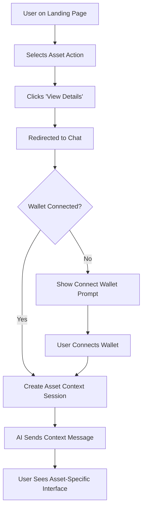
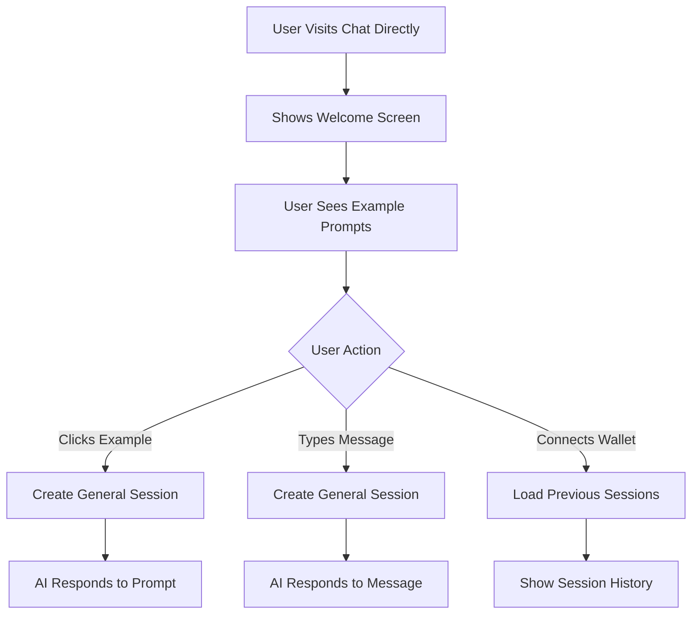
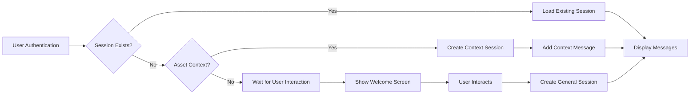
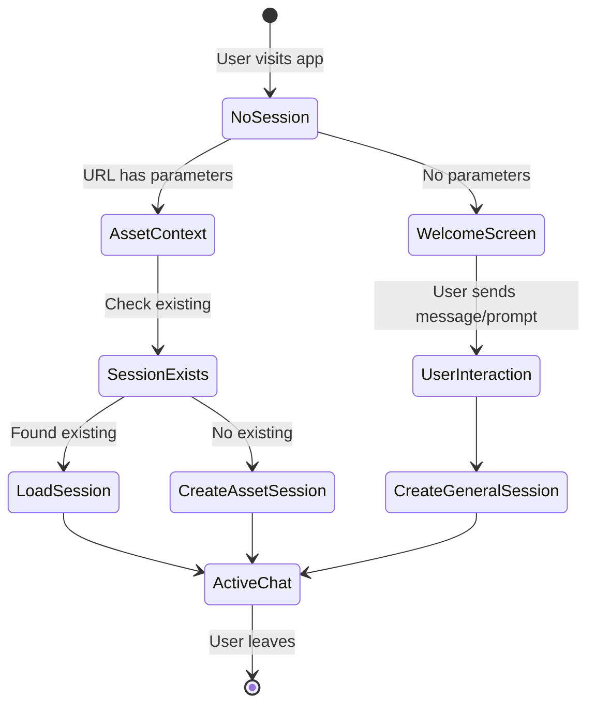

# StratiFi Chat Interface - Complete Implementation Guide

## 📚 Table of Contents

1. [Overview & Architecture](#overview--architecture)
2. [System Flow](#system-flow)
3. [Database Schema](#database-schema)
4. [File Structure](#file-structure)
5. [Core Components](#core-components)
6. [Session Management](#session-management)
7. [Integration Guide](#integration-guide)
8. [Setup Instructions](#setup-instructions)
9. [Testing & Debugging](#testing--debugging)
10. [Troubleshooting](#troubleshooting)

---

## 🏗️ Overview & Architecture

### System Purpose

The StratiFi Chat Interface provides a conversational AI experience for DeFi operations with persistent session tracking, wallet-based authentication, and context-aware responses.

### Key Features

- **Wallet-Based Authentication**: Users identified by wallet addresses
- **Session Persistence**: Chat conversations stored in Supabase
- **Asset Context Awareness**: Landing page redirections create contextual sessions
- **Real-time Updates**: Live message synchronization
- **Session History**: Browse and resume previous conversations

### Technology Stack

```
Frontend: Next.js 15, React, TypeScript, Tailwind CSS
Backend: Supabase (PostgreSQL + Real-time + Auth)
Wallet: Privy.io for wallet connection
UI: shadcn/ui components
State: React hooks with custom session management
```

### Architecture Diagram

```
┌─────────────────┐    ┌──────────────────┐    ┌─────────────────┐
│   Landing Page  │────│   Chat Interface │────│    Supabase     │
│                 │    │                  │    │                 │
│ URL Parameters  │    │ • Session Mgmt   │    │ • Users         │
│ token/pool/act  │    │ • Message Flow   │    │ • Sessions      │
│                 │    │ • AI Responses   │    │ • Messages      │
└─────────────────┘    └──────────────────┘    │ • Activities    │
                                               └─────────────────┘
                              │
                    ┌──────────────────┐
                    │   Privy Wallet   │
                    │   Authentication │
                    └──────────────────┘
```

---

## 🔄 System Flow

### 1. User Journey - Landing Page Redirection



**URL Flow:**

```
Landing Page → Chat Interface
https://stratifi.app/protocols → https://stratifi.app/?token=eth&pool=aave-eth&action=lend
```

### 2. User Journey - Direct App Access



### 3. Session Management Flow



---

## 🗄️ Database Schema

### Supabase Tables

#### 1. Users Table

```sql
CREATE TABLE users (
  id UUID PRIMARY KEY DEFAULT gen_random_uuid(),
  wallet_address VARCHAR(42) UNIQUE NOT NULL,
  created_at TIMESTAMP WITH TIME ZONE DEFAULT NOW(),
  updated_at TIMESTAMP WITH TIME ZONE DEFAULT NOW(),
  last_active TIMESTAMP WITH TIME ZONE DEFAULT NOW(),
  preferences JSONB DEFAULT '{}'
);
```

#### 2. Chat Sessions Table

```sql
CREATE TABLE chat_sessions (
  id UUID PRIMARY KEY DEFAULT gen_random_uuid(),
  user_id UUID NOT NULL REFERENCES users(id) ON DELETE CASCADE,
  session_name VARCHAR(255),
  created_at TIMESTAMP WITH TIME ZONE DEFAULT NOW(),
  updated_at TIMESTAMP WITH TIME ZONE DEFAULT NOW(),
  last_message_at TIMESTAMP WITH TIME ZONE DEFAULT NOW(),
  is_active BOOLEAN DEFAULT true,
  metadata JSONB DEFAULT '{}'
);
```

#### 3. Chat Messages Table

```sql
CREATE TABLE chat_messages (
  id UUID PRIMARY KEY DEFAULT gen_random_uuid(),
  session_id UUID NOT NULL REFERENCES chat_sessions(id) ON DELETE CASCADE,
  role VARCHAR(10) NOT NULL CHECK (role IN ('user', 'ai')),
  content TEXT NOT NULL,
  created_at TIMESTAMP WITH TIME ZONE DEFAULT NOW(),
  metadata JSONB DEFAULT '{}'
);
```

#### 4. User Activities Table

```sql
CREATE TABLE user_activities (
  id UUID PRIMARY KEY DEFAULT gen_random_uuid(),
  user_id UUID NOT NULL REFERENCES users(id) ON DELETE CASCADE,
  session_id UUID REFERENCES chat_sessions(id) ON DELETE SET NULL,
  activity_type VARCHAR(20) NOT NULL CHECK (
    activity_type IN ('borrow', 'lend', 'repay', 'withdraw', 'liquidation')
  ),
  token_symbol VARCHAR(10) NOT NULL,
  pool_id VARCHAR(50) NOT NULL,
  amount DECIMAL(36, 18),
  transaction_hash VARCHAR(66),
  status VARCHAR(20) DEFAULT 'pending',
  created_at TIMESTAMP WITH TIME ZONE DEFAULT NOW(),
  updated_at TIMESTAMP WITH TIME ZONE DEFAULT NOW(),
  metadata JSONB DEFAULT '{}'
);
```

### Key Relationships

- **Users ← Chat Sessions**: One user has many sessions
- **Chat Sessions ← Messages**: One session has many messages
- **Users ← Activities**: One user has many activities
- **Sessions ← Activities**: One session can have many activities (optional)

---

## 📁 File Structure

```
Stratifi_App/
├── app/
│   ├── layout.tsx                 # Root layout with providers
│   ├── page.tsx                   # Home page with URL parameter handling
│   └── providers.tsx              # Context providers setup
│
├── components/
│   ├── layouts/
│   │   ├── main-layout.tsx        # Main app layout wrapper
│   │   └── components/
│   │       ├── app-sidebar.tsx    # Session sidebar (unused in current design)
│   │       └── top-bar.tsx        # Header with chat history & wallet
│   │
│   ├── navigation/
│   │   └── navbar.tsx             # Navigation component
│   │
│   ├── sections/
│   │   └── chat-section.tsx       # Main chat interface
│   │
│   └── ui/                        # shadcn/ui components
│       ├── button.tsx
│       ├── card.tsx
│       ├── input.tsx
│       └── ...
│
├── hooks/
│   └── use-session.ts             # Core session management hook
│
├── lib/
│   ├── supabase.ts                # Supabase client configuration
│   └── utils.ts                   # Utility functions
│
├── types/
│   └── session.ts                 # TypeScript interfaces
│
├── supabase/
│   ├── schema.sql                 # Database schema
│   └── recreate-tables.sql        # Table recreation script
│
└── docs/
    ├── SESSION_TRACKING_DESIGN.md
    └── COMPLETE_IMPLEMENTATION_GUIDE.md
```

---

## 🧩 Core Components

### 1. Chat Section (`components/sections/chat-section.tsx`)

**Purpose**: Main chat interface that handles messages, sessions, and user interactions.

**Key Features**:

- Asset context detection from URL parameters
- Session creation and management
- Message sending and receiving
- AI response simulation
- Welcome screen for new users

**Props**:

```typescript
interface ChatSectionProps {
  token?: string | null; // From URL: ?token=eth
  poolId?: string | null; // From URL: ?pool=aave-eth
  action?: string | null; // From URL: ?action=lend
  onSessionsChange?: (sessions: any[]) => void;
  onCurrentSessionChange?: (session: any) => void;
  externalCurrentSession?: any; // From TopBar session selection
}
```

**Core Logic**:

```typescript
// Asset context session creation
useEffect(() => {
  if (user && token && poolId && action) {
    const contextKey = `${token}-${poolId}-${action}`;

    if (assetContextHandled.current === contextKey) return;

    // Check for existing session or create new one
    const existingSession = sessions.find((session) => {
      const context = session.metadata?.initialContext;
      return (
        context?.token === token &&
        context?.poolId === poolId &&
        context?.action === action
      );
    });

    if (existingSession) {
      setCurrentSession(existingSession);
    } else {
      createSession(user.id, { token, poolId, action });
    }
  }
}, [user, token, poolId, action]);
```

### 2. Session Hook (`hooks/use-session.ts`)

**Purpose**: Centralized session management with Supabase integration.

**Exported Functions**:

```typescript
{
  // State
  user,
    sessions,
    currentSession,
    messages,
    // Authentication
    signInWithWallet,
    signOut,
    // Session Management
    createSession,
    loadSessions,
    loadMessages,
    setCurrentSession,
    clearMessages,
    // Messaging
    addMessage;
}
```

**Key Implementation**:

```typescript
const createSession = useCallback(
  async (userId: string, initialContext?: any) => {
    const sessionName = generateSessionName(initialContext);

    const { data, error } = await supabase
      .from("chat_sessions")
      .insert({
        user_id: userId,
        session_name: sessionName,
        metadata: { initialContext },
      })
      .select()
      .single();

    if (data) {
      setCurrentSession(data);
      setSessions((prev) => [data, ...prev]);
    }

    return data;
  },
  []
);
```

### 3. Top Bar (`components/layouts/components/top-bar.tsx`)

**Purpose**: Header with chat history, new chat button, and wallet connection.

**Features**:

- Icon-only design for clean interface
- Chat history dropdown with session count badge
- New chat creation
- Wallet connection status

**Key Elements**:

```typescript
// New Chat Button
<Tooltip>
  <TooltipTrigger asChild>
    <Button onClick={onNewSession} variant="ghost" size="icon">
      <Plus className="h-5 w-5" />
    </Button>
  </TooltipTrigger>
  <TooltipContent>New Chat</TooltipContent>
</Tooltip>

// History Dropdown with Badge
<Button onClick={() => setShowHistoryDropdown(!showHistoryDropdown)}>
  <History className="h-5 w-5" />
  {sessions.length > 0 && (
    <Badge className="absolute -top-1 -right-1">
      {sessions.length > 9 ? "9+" : sessions.length}
    </Badge>
  )}
</Button>
```

### 4. Home Page (`app/page.tsx`)

**Purpose**: URL parameter extraction and component coordination.

**Implementation**:

```typescript
function HomeContent() {
  const searchParams = useSearchParams();

  // Extract landing page parameters
  const token = searchParams.get("token"); // "eth"
  const poolId = searchParams.get("pool"); // "aave-eth"
  const action = searchParams.get("action"); // "lend"

  // Session state management
  const [sessions, setSessions] = useState<any[]>([]);
  const [currentSession, setCurrentSession] = useState<any>(null);

  return (
    <MainLayout
      sessions={sessions}
      currentSession={currentSession}
      showChatHistory={true}
    >
      <ChatSection
        token={token}
        poolId={poolId}
        action={action}
        onSessionsChange={setSessions}
        onCurrentSessionChange={setCurrentSession}
      />
    </MainLayout>
  );
}
```

---

## 🎛️ Session Management

### Session Types

#### 1. Asset Context Sessions

Created when users arrive from landing page with URL parameters.

**Metadata Structure**:

```json
{
  "initialContext": {
    "token": "eth",
    "poolId": "aave-eth",
    "action": "lend"
  }
}
```

**Session Name**: `"LEND ETH"`, `"BORROW BTC"`, etc.

#### 2. General Chat Sessions

Created when users interact without asset context.

**Metadata Structure**:

```json
{}
```

**Session Name**: `"Chat DD/MM/YYYY"`

### Session Lifecycle



### Duplicate Prevention

The system prevents duplicate sessions using:

1. **Asset Context Tracking**: `assetContextHandled` ref prevents multiple sessions for same asset context
2. **Existing Session Check**: Before creating, checks for existing session with same metadata
3. **Dependency Management**: Removed `sessions` from useEffect dependencies to prevent infinite loops

---

## 🔧 Integration Guide

### Step 1: Environment Setup

Create `.env.local`:

```env
NEXT_PUBLIC_SUPABASE_URL=your-supabase-url
NEXT_PUBLIC_SUPABASE_ANON_KEY=your-anon-key
SUPABASE_SERVICE_ROLE_KEY=your-service-role-key
```

### Step 2: Supabase Configuration

```typescript
// lib/supabase.ts
import { createClient } from "@supabase/supabase-js";

const supabaseUrl = process.env.NEXT_PUBLIC_SUPABASE_URL!;
const supabaseAnonKey = process.env.NEXT_PUBLIC_SUPABASE_ANON_KEY!;

export const supabase = createClient(supabaseUrl, supabaseAnonKey);
```

### Step 3: Database Setup

Run the schema creation script:

```sql
-- Execute supabase/schema.sql in your Supabase dashboard
-- Or use Supabase CLI: supabase db push
```

### Step 4: Component Integration

```typescript
// Your main page component
import { ChatSection } from "@/components/sections/chat-section";
import { useSearchParams } from "next/navigation";

export default function YourChatPage() {
  const searchParams = useSearchParams();

  return (
    <ChatSection
      token={searchParams.get("token")}
      poolId={searchParams.get("pool")}
      action={searchParams.get("action")}
      onSessionsChange={(sessions) => {
        // Handle session updates
      }}
      onCurrentSessionChange={(session) => {
        // Handle current session changes
      }}
    />
  );
}
```

### Step 5: Landing Page Integration

Update your landing page to include the redirect URLs:

```typescript
// Landing page component
const handleViewDetails = (token: string, poolId: string, action: string) => {
  const chatUrl = `${process.env.NEXT_PUBLIC_APP_URL}/?token=${token}&pool=${poolId}&action=${action}`;
  window.open(chatUrl, "_blank");
};

// Protocol card
<Button onClick={() => handleViewDetails("eth", "aave-eth", "lend")}>
  View Details
</Button>;
```

---

## 🚀 Setup Instructions

### Prerequisites

- Node.js 18+
- Supabase account
- Next.js 13+ project

### Installation

1. **Install Dependencies**:

```bash
npm install @supabase/supabase-js @privy-io/react-auth
npm install @supabase/ssr  # For Next.js integration
npm install dotenv  # For environment variables
```

2. **Create Supabase Project**:

   - Go to [supabase.com](https://supabase.com)
   - Create new project
   - Note down URL and anon key

3. **Setup Database**:

```bash
# Copy schema to Supabase SQL editor and execute
cp supabase/schema.sql supabase_dashboard/sql_editor/
```

4. **Configure Environment**:

```bash
cp .env.example .env.local
# Fill in your Supabase credentials
```

5. **Test Database Connection**:

```bash
node check-data.js  # Should show empty tables
```

6. **Start Development Server**:

```bash
npm run dev
```

### Verification Tests

1. **Direct Access Test**:

   - Visit `http://localhost:3001/`
   - Should show welcome screen
   - Click example prompt → should create session

2. **Asset Context Test**:

   - Visit `http://localhost:3001/?token=eth&pool=aave-eth&action=lend`
   - Should create asset context session
   - AI should send contextual message

3. **Database Verification**:

```bash
node check-data.js  # Should show created sessions
```

---

## 🧪 Testing & Debugging

### Debug Console Logs

The system includes comprehensive console logging:

```typescript
// Session creation
console.log("Creating/loading session for asset context:", {
  token,
  poolId,
  action,
});

// User authentication
console.log("Setting up user session for wallet:", walletAddress);

// Message handling
console.log("Adding user message to session:", sessionId);
```

### Testing Scripts

Create test scripts for verification:

```javascript
// test-connection.js
require("dotenv").config({ path: ".env.local" });
const { createClient } = require("@supabase/supabase-js");

async function testConnection() {
  const supabase = createClient(
    process.env.NEXT_PUBLIC_SUPABASE_URL,
    process.env.SUPABASE_SERVICE_ROLE_KEY
  );

  const { data, error } = await supabase
    .from("users")
    .select("count(*)")
    .single();

  console.log("Connection test:", error ? "Failed" : "Success");
  console.log("Users count:", data?.count || 0);
}

testConnection();
```

### Common Debug Points

1. **Session Creation Issues**:

   - Check if `user` object exists
   - Verify URL parameters are being extracted
   - Ensure `assetContextHandled` ref is working

2. **Message Not Saving**:

   - Check Supabase connection
   - Verify session exists before adding message
   - Check database permissions

3. **Duplicate Sessions**:
   - Check `assetContextHandled` ref logic
   - Verify useEffect dependencies
   - Look for infinite loops in console

---

## 🔧 Troubleshooting

### Common Issues

#### 1. "No current session to add message to"

**Cause**: Session not created before message sending
**Solution**: Ensure session creation logic in `handleSend` and `handlePromptClick`

#### 2. Multiple Sessions Created

**Cause**: Infinite loop in useEffect
**Solution**: Check dependency arrays and use refs for tracking

#### 3. Asset Context Not Working

**Cause**: URL parameters not being passed correctly
**Solution**: Verify `useSearchParams` and prop passing

#### 4. Database Connection Failed

**Cause**: Incorrect environment variables
**Solution**: Check `.env.local` file and Supabase project settings

### Performance Optimization

1. **Session Loading**: Use pagination for large session lists
2. **Message Loading**: Implement infinite scroll for long conversations
3. **Real-time Updates**: Optimize Supabase subscriptions
4. **Component Re-renders**: Use React.memo for expensive components

### Security Considerations

1. **Row Level Security**: Ensure RLS policies are correctly configured
2. **Environment Variables**: Keep service role key secure
3. **User Data**: Validate all user inputs
4. **Session Management**: Implement proper session expiry

---

## 📋 Quick Reference

### Key URLs

- **Direct Access**: `http://localhost:3001/`
- **Asset Context**: `http://localhost:3001/?token=eth&pool=aave-eth&action=lend`

### Key Functions

- `signInWithWallet(address)`: Authenticate user
- `createSession(userId, context?)`: Create new session
- `addMessage(content, role, session?)`: Add message to session
- `loadSessions(userId)`: Load user's sessions

### Key Components

- `<ChatSection />`: Main chat interface
- `<TopBar />`: Header with history
- `useSession()`: Session management hook

### Database Tables

- `users`: User accounts
- `chat_sessions`: Conversation sessions
- `chat_messages`: Individual messages
- `user_activities`: DeFi transactions

This guide provides everything needed to understand, integrate, and extend the StratiFi chat interface system. For specific implementation questions, refer to the individual component files and their inline documentation.
